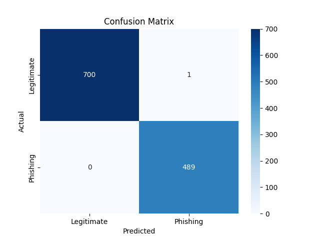
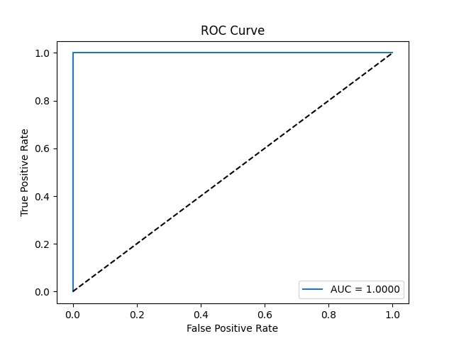

# **BEC Email Classifier: Detecting Phishing with Machine Learning**
> A project built on the **Enron Dataset** containing 500,000+ emails, showcasing how machine learning can detect phishing attempts with precision and reliability.

---

## **Table of Contents**
1. [Project Overview](#project-overview)
2. [Objectives](#objectives)
3. [Key Steps](#key-steps)
   - [Data Preparation](#data-preparation)
   - [Feature Engineering](#feature-engineering)
   - [Model Training](#model-training)
   - [Evaluation](#evaluation)
   - [Real-Time Detection](#real-time-detection)
4. [Algorithms Used](#algorithms-used)
5. [Setup and Execution](#setup-and-execution)
6. [Key Findings and Results](#key-findings-and-results)
7. [Future Improvements](#future-improvements)
8. [Datasets Used](#datasets-used)
9. [Challenges Faced](#challenges-faced)


---

## **Project Overview**
In this project, I created a **BEC Email Classifier** to detect phishing attempts in emails by:
- Leveraging **machine learning models** like Random Forests.
- Preprocessing and extracting text-based features using **TF-IDF Vectorization**.
- Building a **real-time detection pipeline** for new emails.

This end-to-end project focuses on real-world applicability and provides robust results through detailed data preparation, feature engineering, and model evaluation.

---

## **Objectives**
The goal was to:
1. Detect phishing emails in real-time with high accuracy.
2. Build an end-to-end machine learning pipeline.
3. Use a real-world dataset for training and evaluation.

---

## **Key Steps**

### **1. Data Preparation**
The dataset consisted of raw emails with columns like `sender`, `subject`, `body`, and `label`. I performed:
- **Cleaning**: Removed duplicates and NaN values.
- **Preprocessing**: Combined `subject` and `body` columns for meaningful text features.
- **Output**: Saved the cleaned data to `processed_emails.csv`.

### **2. Feature Engineering**
I used **TF-IDF Vectorization** to extract features from email text:
- Set `max_features=5000` to limit vocabulary size.
- Stored the vectorizer as `vectorizer.pkl` for real-time predictions.
- Split data into `features.npy` and `labels.npy`.

### **3. Model Training**
I trained a **Random Forest Classifier**:
- **Hyperparameters**:
  - `max_depth`: Tested [10, 20, None].
  - `n_estimators`: Tested [50, 100, 200].
  - `min_samples_split`: Tested [2, 5, 10].
- Used **GridSearchCV** for optimal hyperparameter selection.
- Saved the model as `email_classifier.pkl`.

### **4. Evaluation**
I evaluated the model using:
- **Metrics**: Accuracy, Precision, Recall, F1-score.
- **Visualizations**:
  - Confusion Matrix: Shows True Positives, True Negatives, False Positives, and False Negatives.
  - AUC-ROC Curve: Assesses model performance at various thresholds.

### **5. Real-Time Detection**
Implemented a script for classifying new emails:
- User inputs the email `subject` and `body`.
- The model outputs:
  - Prediction: **Legitimate** or **Phishing**.
  - Confidence score (e.g., 95%).

---

## **Algorithms Used**
- **TF-IDF Vectorization**: Converts text into numerical features based on term frequency and inverse document frequency.
- **Random Forest Classifier**: A robust ensemble learning method for classification tasks.
- **GridSearchCV**: Used for optimal hyperparameter selection, ensuring the best combination of parameters like `n_estimators`, `max_depth`, and `min_samples_split` for the Random Forest model.


---

## **Setup and Execution**
### **Step 1: Install Dependencies**
Run the following command to install all required libraries:
```bash
pip install -r requirements.txt
```
### **Step 2: Run Scripts**
Follow these steps to execute the project in sequence:

1. **Data Preparation**: Preprocess the raw dataset and save it for feature extraction.  
```bash
python scripts/preprocess.py
```


2. **Feature Engineering**: Extract numerical features from email text using TF-IDF and save the vectorized output.  
```bash
python scripts/feature_engineering.py
```


3. **Model Training**: Train the Random Forest Classifier with GridSearchCV and save the trained model.  
```bash
python scripts/train_model.py
```


4. **Evaluation**: Evaluate the model on the test dataset and generate performance metrics and visualizations.  
```bash
python scripts/evaluate_model.py
```

5. **Real-Time Detection**: Test the model with custom email inputs to classify them as "Legitimate" or "Phishing".  
```bash
python scripts/detect_email.py
```

---

## **Key Findings and Results**
### **1. Performance Metrics**
- **Accuracy**: Achieved ~99.58% accuracy on the test set.
- **AUC-ROC Score**: 1.00, indicating perfect discrimination between legitimate and phishing emails.

### **2. Visual Results**
- **Confusion Matrix**:
  Shows how many emails were correctly classified as legitimate or phishing.  
  
  - **Explanation**:  
  The confusion matrix provides insights into the model's performance by showing the number of correct and incorrect classifications:
  - **True Positives (TP)**: Emails correctly classified as phishing.
  - **True Negatives (TN)**: Emails correctly classified as legitimate.
  - **False Positives (FP)**: Legitimate emails incorrectly classified as phishing.
  - **False Negatives (FN)**: Phishing emails incorrectly classified as legitimate.  
  This helps identify areas where the model might need improvement.


- **AUC-ROC Curve**:  
  Demonstrates the model's performance at various classification thresholds.  
  
  - **Explanation**:  
  The AUC-ROC curve evaluates the model's ability to distinguish between classes (legitimate vs. phishing). A perfect score of **1.0** indicates that the model is highly effective in separating the two classes without overlap.


---

## **Challenges Faced**

1. **Data Imbalance**:  
   Initially, the dataset was unbalanced, making it difficult for the model to generalize. This was mitigated by rebalancing the data and careful feature selection.

2. **Misclassifications**:  
   Certain nuanced phishing emails, especially those mimicking legitimate communication, posed challenges and pointed to the need for deeper semantic understanding.

3. **Dataset Limitations and Overfitting**:  
   When starting with the **[Enron Email Dataset](https://www.kaggle.com/datasets/wcukierski/enron-email-dataset)**, I trained the model for several hours and achieved an accuracy of **100%**.  
   - I later realized the Enron dataset contained **only legitimate emails**, causing the model to overfit and classify everything as "Legitimate."  
   - It was a hard lesson but essential for identifying the limitations of real-world datasets.

4. **Switching to a New Dataset**:  
   After discovering the issue, I transitioned to using the **[Human-LLM Generated Phishing and Legitimate Emails Dataset](https://www.kaggle.com/datasets/francescogreco97/human-llm-generated-phishing-legitimate-emails)**.  
   - This dataset has **balanced classes** (2000 phishing emails and 2000 legitimate emails), which provided a much better foundation for training and evaluation.  
   - It also includes **LLM-generated phishing and legitimate emails**, ensuring the model can handle modern phishing tactics.

5. **Future Enhancements**:  
   My plan is to integrate the **[Phishing Email Dataset](https://www.kaggle.com/datasets/naserabdullahalam/phishing-email-dataset/data)**, which has **82,500 phishing emails**, with a balanced sample (~82,000 emails) from the Enron dataset.  
   - This will allow the classifier to handle larger, more diverse datasets and avoid bias while ensuring equal representation of phishing and legitimate emails.
   - This step is critical to achieving a robust, production-ready phishing detection system.

---

## **Future Improvements**
1. **Dataset Expansion**:
   - Add more real-world phishing email samples from diverse sources.
   - Include different phishing attack types (e.g., ransomware, job scams).

2. **Model Enhancement**:
   - Experiment with advanced NLP models like **BERT** or **RoBERTa** for semantic understanding.
   - Incorporate **ensemble methods** combining multiple classifiers for increased robustness.

3. **Interactive Interface**:
   - Build a web application or mobile app for real-time email classification.
   - Include visual explanations (e.g., highlighting suspicious words in the email).

4. **Feature Enrichment**:
   - Use sender metadata and historical patterns for additional context.
   - Incorporate URL analysis for detecting malicious links in emails.

---

## **Datasets Used**

This project utilized multiple datasets to develop and improve the phishing email classifier:

1. **[Enron Email Dataset](https://www.kaggle.com/datasets/wcukierski/enron-email-dataset)**  
   - Contains over 500,000 legitimate emails from the Enron Corporation.  
   - Initially used for training the model but later discovered to contain only legitimate emails, which skewed the results.  

2. **[Human-LLM Generated Phishing and Legitimate Emails Dataset](https://www.kaggle.com/datasets/francescogreco97/human-llm-generated-phishing-legitimate-emails)**  
   - A balanced multiclass dataset of **4000 emails** containing:
     - **1000 Human-generated legitimate emails.**
     - **1000 Human-generated phishing emails.**
     - **1000 LLM-generated legitimate emails.**
     - **1000 LLM-generated phishing emails.**  
   - Used as the primary dataset for training the current working model.

3. **[Phishing Email Dataset](https://www.kaggle.com/datasets/naserabdullahalam/phishing-email-dataset/data)**  
   - Contains **82,500 phishing emails** from diverse phishing categories.  
   - Planned for future enhancements to combine with a balanced subset from the Enron dataset for a more robust classifier.
---
