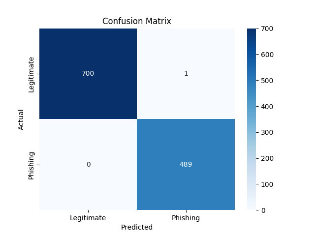

# Evaluation Report
### Model Performance Metrics
- **ROC AUC Score**: 0.00

### Classification Report
```
              precision    recall  f1-score   support

  Legitimate       1.00      1.00      1.00    103481
 BEC Attempt       0.00      0.00      0.00         0

    accuracy                           1.00    103481
   macro avg       0.50      0.50      0.50    103481
weighted avg       1.00      1.00      1.00    103481

```

### Confusion Matrix


### AUC-ROC Curve

